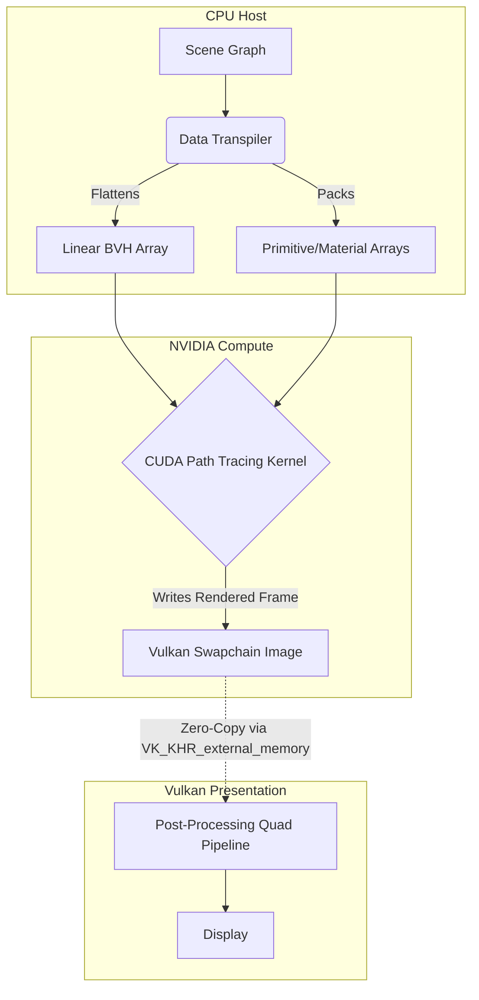

# CUDA and Vulkan Path Tracer


A high-performance GPU path tracer utilizing CUDA for compute and a custom Vulkan presentation layer. 
The project implements advanced path tracing algorithms, spatial acceleration structures, and a data-oriented architecture designed for optimal parallel execution.

## Rendering Performance Comparison (Video sped up 45x)


https://github.com/user-attachments/assets/5fad7c5e-e44a-4a9f-904a-4c3c3b3cec6e


*CPU wall time: 1 hour 30 minutes (12 threads). GPU wall time: 58 seconds. ~93x speedup*

## Architecture and Technical Implementation



### Zero-Copy Vulkan Interoperability

To eliminate PCIe memory transfer bottlenecks between the compute device and the presentation layer, the application utilizes `VK_KHR_external_memory`. 
Rendered frames are computed directly into Vulkan swapchain images that are mapped to CUDA memory via `cudaExternalMemory`. 
Execution synchronization is maintained using external semaphores, ensuring minimal latency and strict execution ordering between the CUDA compute kernels and the Vulkan presentation pipeline.

### Data-Oriented Scene Transpilation: SoA vs AoS

Polymorphic object hierarchies and materials present performance issues for SIMT execution models due to branching divergence and virtual function overhead. 
To resolve this, a CPU-side transpilation phase flattens scene graphs into contiguous array structures. 
Bounding Volume Hierarchies (BVH), primitives (spheres, quadrilaterals, moving geometries), and material definitions are packed into optimal memory layouts before transfer to device memory.

Furthermore, critical ray state tracking heavily utilizes the **Structure of Arrays (SoA)** paradigm over the traditional **Array of Structures (AoS)**. This ensures fully coalesced global memory accesses across CUDA warps.

**Code Concept Comparison:**

```cpp
//  AoS (Array of Structures) - Poor memory coalescing on GPU
struct PathStateAoS {
    vec3 ray_origin;
    vec3 ray_direction;
    vec3 attenuation;
    int pixel_index;
    bool active;
};
PathStateAoS paths[MAX_PATHS]; 

//  SoA (Structure of Arrays) - Optimal for SIMT execution
struct PathStateSoA {
    vec3* ray_origins;
    vec3* ray_directions;
    vec3* attenuations;
    int* pixel_indices;
    bool* active;
};
PathStateSoA paths; 
```

**Memory Layout Visualization:**

```text
Warp executing instruction: Load "attenuation" for Threads 0-3

AoS Memory Layout (Large Stride):
[ O0 | D0 | A0 | P0 ]  [ O1 | D1 | A1 | P1 ]  [ O2 | D2 | A2 | P2 ]  [ O3 | D3 | A3 | P3 ]
            ^^                     ^^                     ^^                     ^^
            Cache misses frequent. Uncoalesced fetch across multiple cache lines.

SoA Memory Layout (Contiguous):
[ O0 | O1 | O2 | O3 ]  [ D0 | D1 | D2 | D3 ]  [ A0 | A1 | A2 | A3 ]  [ P0 | P1 | P2 | P3 ]
                                               ^^^^^^^^^^^^^^^^^^^
                                              One fully coalesced fetch. 100% bandwidth usage.
```


### Bounding Volume Hierarchy Acceleration

Intersection calculations are accelerated using a custom BVH implementation. The spatial partitioning algorithm reduces ray-primitive intersection complexity from O(N) to O(log N). 
The GPU traversal kernel utilizes a flat-array representation of the BVH, employing iterative traversal with a local stack to avoid recursion constraints inherent to device kernels.

```cpp
// Avoiding recursion constraints via an iterative local stack
__device__ inline bool hit_linear_bvh(...) {
  int stack[64];
  int stack_ptr = 0;
  stack[stack_ptr++] = 0;

  bool hit_anything = false;
  float closest_so_far = t_max;

  while (stack_ptr > 0) {
    int node_idx = stack[--stack_ptr];
    const LinearBVHNode& node = bvh_nodes[node_idx];

    // O(1) Bounding Box Intersection
    if (!aabb_hit(node.aabb_min, node.aabb_max, ray, t_min, closest_so_far)) continue;

    if (node.n_primitives > 0) { 
      // Evaluate Leaf Node...
    } else { 
      // Push interior children (Right first for LIFO Left-first traversal)
      stack[stack_ptr++] = node.second_child_offset;
      stack[stack_ptr++] = node_idx + 1;
    }
  }
  return hit_anything;
}
```

### Render Pipeline Features

* **Geometries:** Static and moving spheres, quadrilaterals, complex instancing, and participating media (volumetric fog).
* **Material Models:** Lambertian diffuse, metallic reflection, dielectric refraction, and emissive surfaces.
* **Procedural and Image Textures:** Iterative material sampling supports mapped images and procedural Perlin noise.
* **Post-Processing:** A Vulkan full-screen quad pipeline applies ACES tonemapping for HDR to LDR conversion.
* **Multi-Threading:** A dynamic thread-pool implementation for CPU rendering parity.

## Interactive Application

The project includes a fully interactive UI built with ImGui. It allows dynamic switching between the multi-threaded CPU renderer and the CUDA backend. 
Users can select predefined scenes, adjust camera parameters (field of view, position, depth of field), and modify rendering settings (samples per pixel, maximum bounce depth) in real time.


## Build Instructions

### Prerequisites

* NVIDIA CUDA Toolkit 11.0+
* Vulkan SDK
* CMake 3.15+
* C++17 compliant compiler

### Compilation

```bash
mkdir build
cd build
cmake ..
make -j
./main
```


